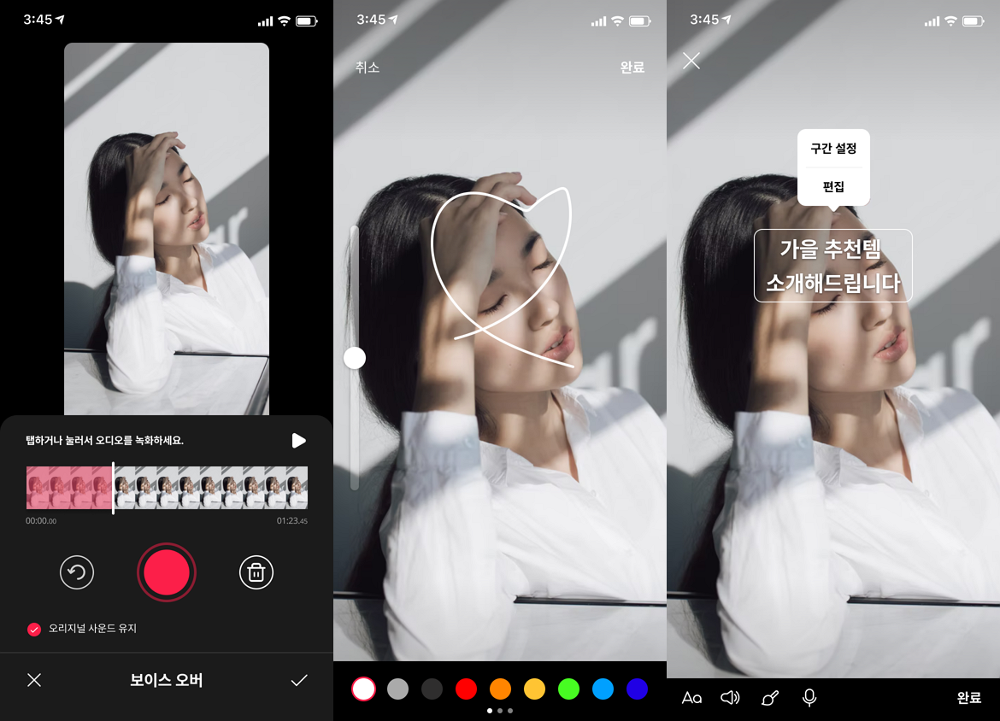

# AWS MediaConvert를 이용한 비디오 스트리밍 시스템 개발

## 서버 구성

사용자의 촬영 영상을 자르거나 위에 글씨 또는 그림 그릴 수 있어야 하고, 애니메이션 스티커를 추가하는 등의 요구사항 때문에
EC2와 FFMPEG을 이용해서 인코딩 서버를 구성하고 있었으나 개발 시간을 단축하기 위해서 AWS MediaConvert를 사용하게 되었습니다.

MediaConvert에서는 손글씨 등을 영상위에 겹쳐서 처리할 수가 없어서 영상 자르기 및 HLS 인코딩 기능만 사용하고,
영상 위에 그려져야 할 정보가 담긴 파일을 함께 저장해서
사용자 앱의 영상 플레이어가 이를 해석하고 정해진 위치와 시간에 맞춰
영상 위에 표시되는 형식을 취하고 있습니다.

### 영상 편집 스크린 샷

## 동작 설명

### 서버 동작 설명

### 클립 영상 플레이어 동작 설명

